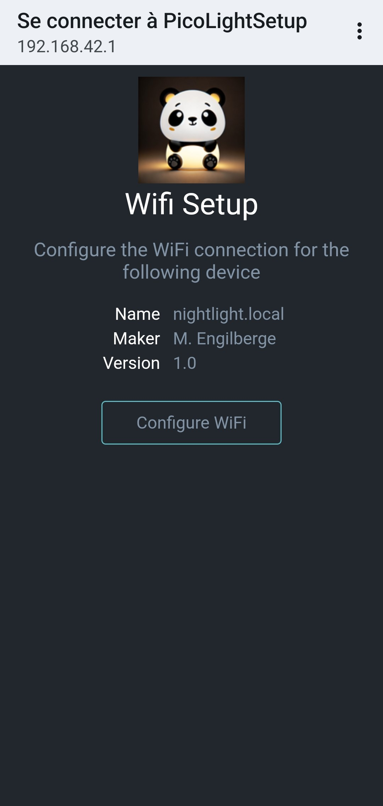
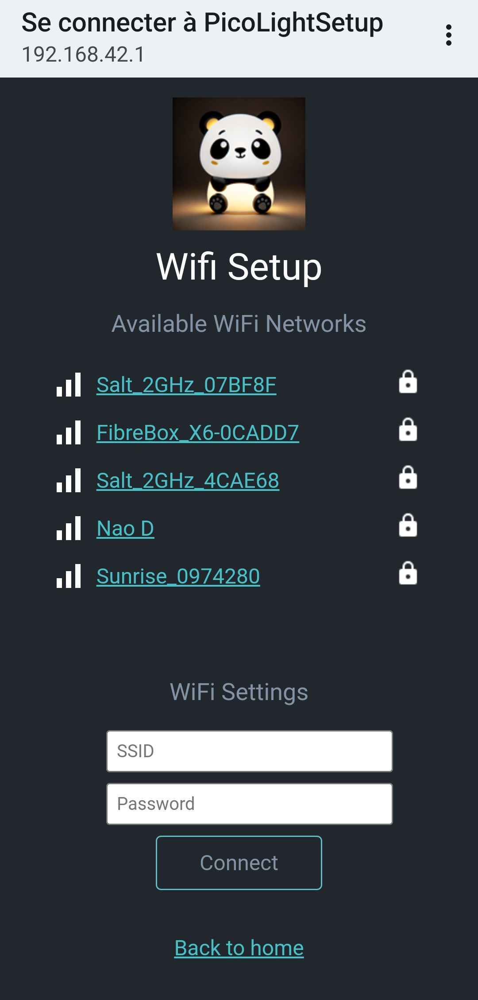
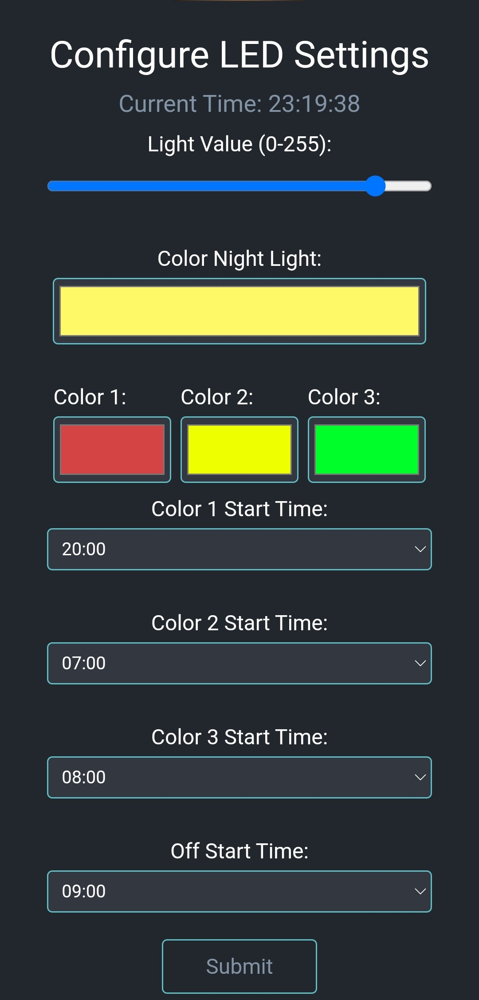

# Pico Night Light

    

## Description

This repository contains the code to build a connected night light. It is designed for the Raspberry Pi Pico board and Neopixel sk6812. The night light has two main functionalities that can be toggled using a switch wired to GPIO 10.

1. Standard Night Light: This functionality allows you to configure the intensity and color of the light.

2. Time Light: This functionality uses three Neopixels, each of which turns on during a specific time period. For example, you can set different colors for bedtime, sleep time, and wake-up time.

Additionally, there is a second switch wired to GPIO 21 that enables the configuration mode. When enabled, the device connects to Wi-Fi and serves a configuration webpage on the local network at the address [nightlight.local](nightlight.local). On this page the color of the light and the time period can be configured.

Upon first power-up, the light starts in Wi-Fi configuration mode, indicated by three Neopixels lighting up in red, yellow, and blue. It creates a Wi-Fi access point, and when connected to the access point, a captive portal allows the user to connect the light to a Wi-Fi router. This connection is later used on startup to acquire the time or can be accessed when the configuration mode is enabled to access the configuration page.

## Screenshots

    
    
    

## Features

- Captive web portal for initial WiFi setup.
- Configuration webpage for setting up light RGB and time period.
- Configuration saved on EEPROM and loaded on power up.

## Getting Started

The project was developed using the Pico Arduino core.

### Installation

1. Install the Pi Pico Arduino core from [here](https://github.com/earlephilhower/arduino-pico?tab=readme-ov-file).
2. Install the following dependencies:
    - [CRC](https://github.com/RobTillaart/CRC)
    - [Adafruit_NeoPixel](https://github.com/adafruit/Adafruit_NeoPixel)

### Bill of Material

Here is the list of components required for the Pico Night Light project:

- Raspberry Pi Pico board
- Neopixel sk6812
- Switch (wired to GPIO 10)
- Switch (wired to GPIO 21)

## Contributing

Contributions are welcome! Here are a few ideas for new features to develop:

- Include alarm clock functionality such as sunrise simulation.
- Add simple soothing light animations to help with falling asleep.

Feel free to contribute and improve the project!

## License

This project is licensed under the [License Name](LICENSE).

## Acknowledgements

- The web portal is adapted from [WiFiManager Pico](https://github.com/mthorley/wifimanager-pico)
